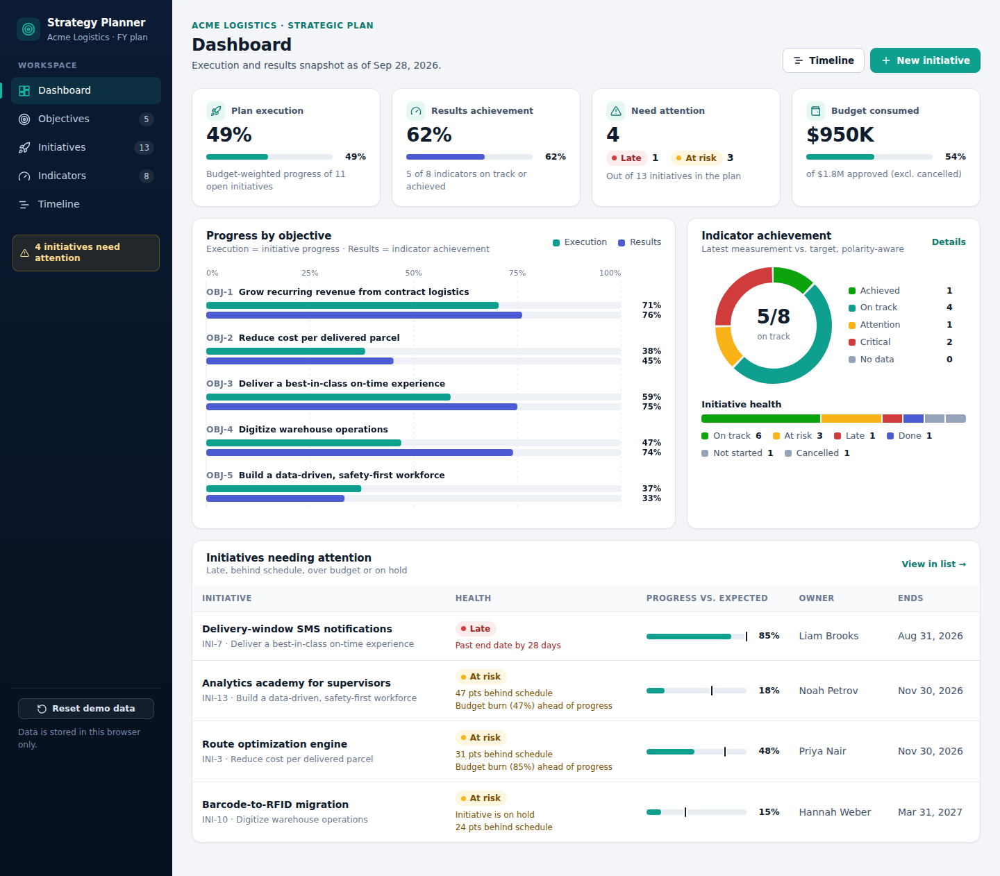
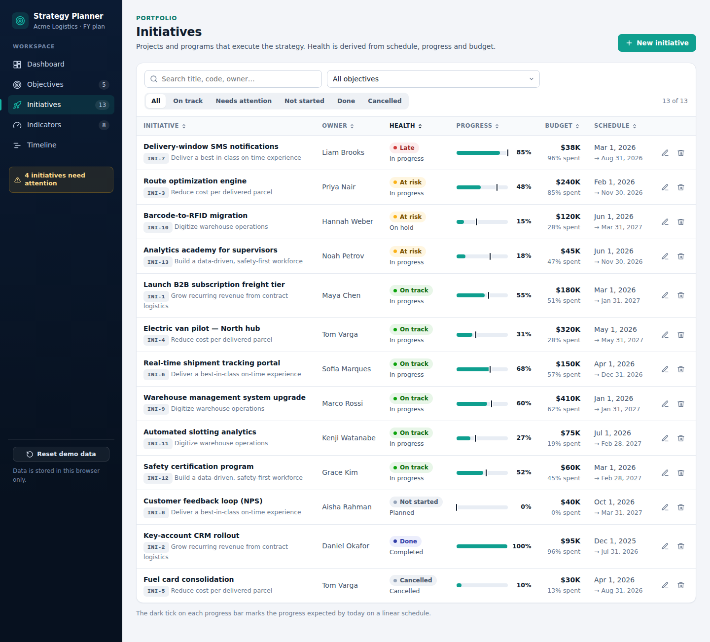
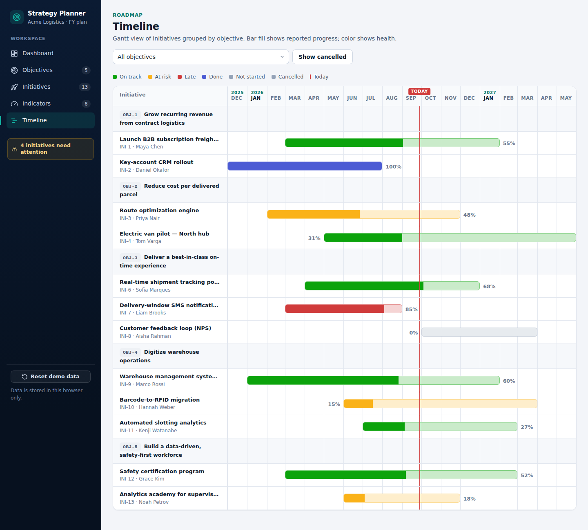
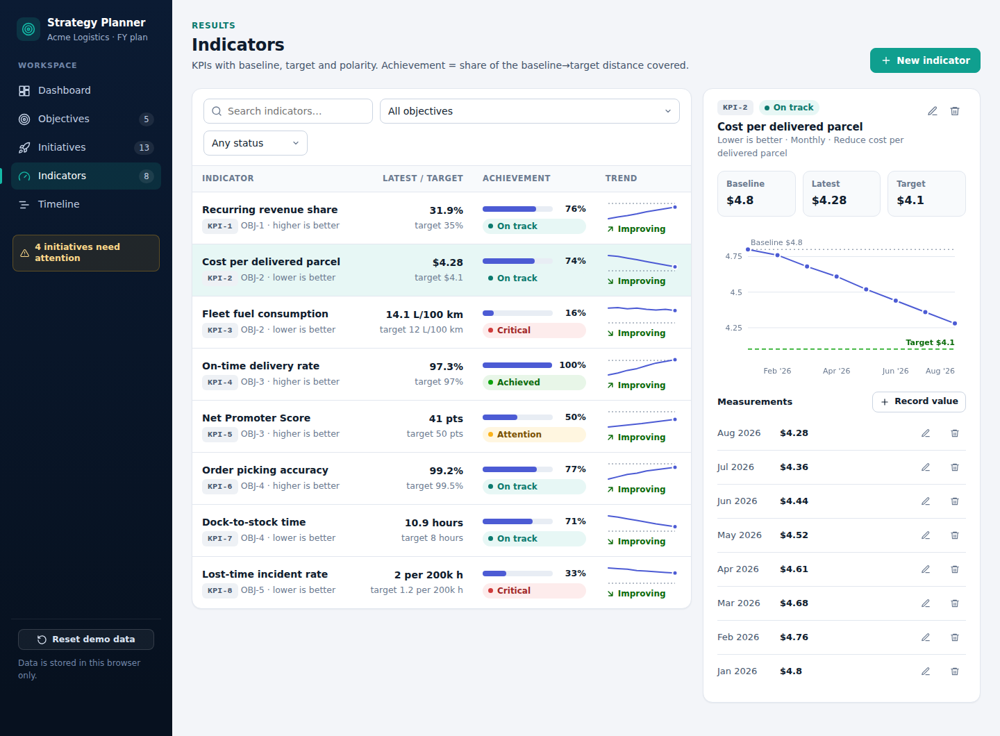
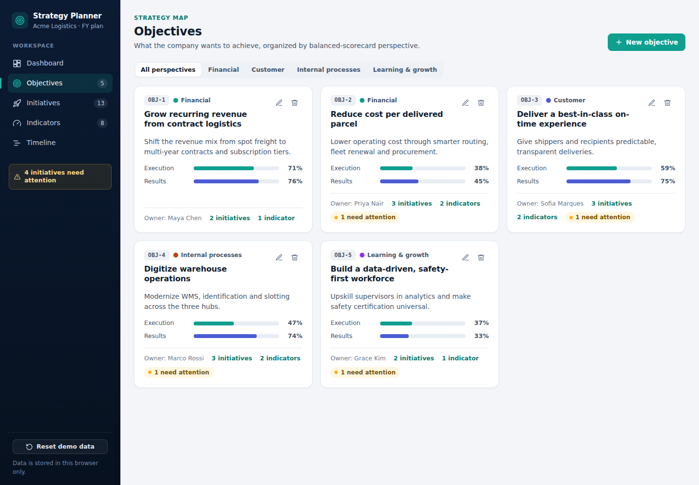
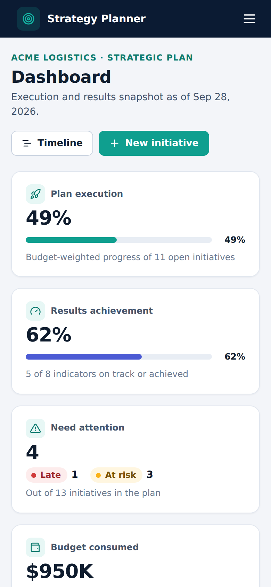
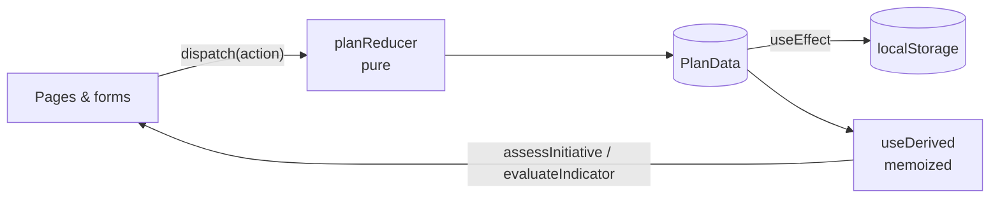
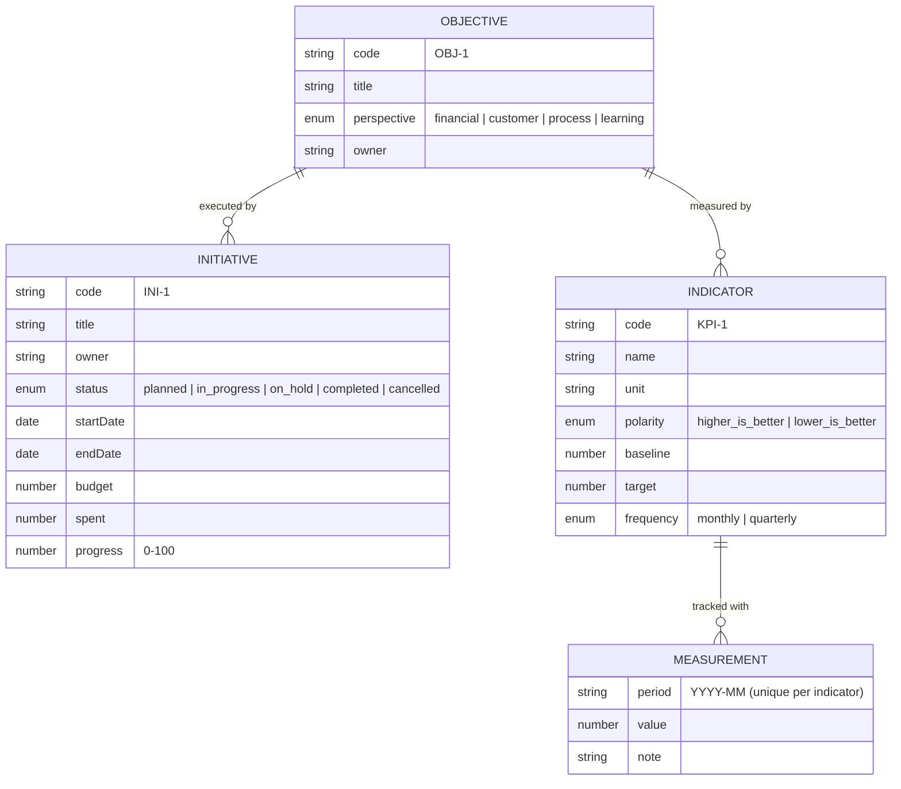

# Strategy Planner

**Turn a strategic plan into something you can actually run.** Strategy Planner is a
single-page app to manage strategic **objectives**, the **initiatives** that execute them
and the **indicators** that prove they worked, with a dashboard that shows at a glance
what is on track, what is slipping and why.

It runs on demo data for **Acme Logistics**, a fictional parcel and contract-logistics
company.

**[Live demo →](https://lucascampos-dev.github.io/strategy-planner/)**


---

## Screenshots

### Dashboard

Execution vs. results per objective, indicator achievement, initiative health and a
ranked list of what needs attention, each item with the reason it was flagged.



### Initiatives

Search, filter by objective and health, sort any column. The dark tick on each progress
bar marks where the initiative _should_ be today.



### Timeline

Gantt view grouped by objective. Bar color shows health and the fill shows reported
progress. A "today" marker makes slippage visible.



<details>
<summary>More screens: indicators, objectives, mobile</summary>





</details>

---

## Features

- **Objectives**, grouped by balanced-scorecard perspective, with execution and results
  roll-ups on every card.
- **Initiatives** with owner, status, start/end dates, budget, amount spent and % progress.
  - **Health is derived, not typed in.** Rules combine status, schedule, progress and
    budget burn into _On track / At risk / Late / Done / Not started / Cancelled_, and
    each flag comes with a readable reason ("31 pts behind schedule", "Budget burn (85%)
    ahead of progress").
- **Indicators (KPIs)** with baseline, target, unit, frequency and **polarity** (higher-
  or lower-is-better). Achievement is the share of the baseline→target distance covered,
  so a cost KPI that goes _down_ is counted as progress.
- **Periodic measurements** with one value per indicator per period, a history chart with
  baseline/target reference lines and a trend read through the polarity.
- **Dashboard** with KPI tiles, paired execution/results bars per objective, an indicator
  status donut, an initiative health strip and an "initiatives needing attention" table.
- **Timeline / Gantt** with month grid, today marker, objective filter and a toggle for
  cancelled work.
- **Create / edit / delete** for every entity, in accessible modal forms with field-level
  validation. Deletes cascade, so an objective takes its initiatives, indicators and
  measurements with it.
- **Filters live in the URL** (`#/initiatives?health=attention&objective=obj-3`), so every
  view can be linked and bookmarked.
- **Persistence** in `localStorage` (guarded with try/catch for private mode or a full
  quota), plus a **Reset demo data** button.
- **Responsive**: the sidebar becomes a drawer and tables become cards on small screens.
- **No UI kit and no chart library.** Charts are hand-written SVG and styling is plain CSS
  with design tokens. The whole app is about 75 kB gzipped.

## Tech stack

| Area      | Choice                                                                                       |
| --------- | -------------------------------------------------------------------------------------------- |
| Framework | React 18 + TypeScript (`strict`, `noUncheckedIndexedAccess`)                                 |
| Build     | Vite 6                                                                                       |
| Routing   | React Router 6 (`HashRouter`, so it works on GitHub Pages)                                   |
| State     | `useReducer` + Context, with derived data memoized in a hook                                 |
| Styling   | Plain CSS with design tokens (`src/styles/tokens.css`)                                       |
| Charts    | Hand-made SVG components (bars, donut, line, sparkline, Gantt)                               |
| Tests     | Vitest (domain rules, reducer, storage, seed integrity)                                      |
| Quality   | ESLint (flat config, typescript-eslint, react-hooks) + Prettier                              |
| CI/CD     | GitHub Actions: lint, format check, tests and build on every PR; deploy to Pages from `main` |

## Architecture

### Folder structure

```
src/
├── domain/                 # Pure business logic: no React, no I/O
│   ├── types.ts            # Domain model
│   ├── logic.ts            # Health rules, roll-ups, achievement, trends
│   ├── validation.ts       # Form/entity validation rules
│   ├── dates.ts            # UTC-safe ISO date helpers
│   ├── format.ts           # Number/date formatting and labels
│   ├── seed.ts             # Fictional demo data (dates relative to today)
│   └── *.test.ts
├── state/
│   ├── reducer.ts          # Pure reducer: upserts, cascading deletes
│   ├── storage.ts          # localStorage load/save with schema guard
│   ├── PlanContext.tsx     # Provider: useReducer + persistence
│   ├── context.ts
│   └── usePlan.ts          # usePlan() and useDerived() (memoized views)
├── components/
│   ├── charts/             # SVG charts: ObjectiveBars, Donut, LineChart, Sparkline
│   ├── forms/              # Objective / Initiative / Indicator / Measurement forms
│   └── Layout, Modal, Field, Badges, ProgressBar, Icon…
├── pages/                  # Dashboard, Objectives, Initiatives, Indicators, Timeline
└── styles/                 # tokens.css, base.css, layout.css, components.css
powerapps/                  # The same domain as a Power Apps + SharePoint build
scripts/screenshots.mjs     # Playwright script that generates the README images
```

### State and data flow



- **One source of truth.** `PlanData` holds only raw entities. Health, achievement and
  roll-ups are always computed from it and never stored, so they can't drift.
- **Business rules are pure functions** that take `today` as a parameter. That makes them
  deterministic and easy to test, and it's why the same rules could move to an API or a
  Power Fx formula unchanged (see [`powerapps/`](powerapps/)).
- **The reducer is pure and exhaustive.** TypeScript's `never` check means every action is
  handled.

### Domain model



### Key business rules

| Rule                                                                                                                                         | Where                         |
| -------------------------------------------------------------------------------------------------------------------------------------------- | ----------------------------- |
| Expected progress rises linearly from 0% on the start date to 100% on the end date                                                           | `expectedProgress()`          |
| `completed` and `cancelled` always win. After the end date → **Late**. `on_hold` → **At risk**. `planned` after its start date → **At risk** | `assessInitiative()`          |
| In progress → **At risk** if progress trails the schedule by more than 15 pts, or budget burn runs more than 25 pts ahead of progress        | `assessInitiative()`, `RULES` |
| Objective execution = budget-weighted average progress, excluding cancelled work (unweighted if there are no budgets)                        | `rollUpProgress()`            |
| Achievement = distance covered from baseline to target, polarity-aware, capped between 0 and 1                                               | `achievement()`               |
| Bands: ≥100% Achieved · ≥70% On track · ≥40% Attention · below that, Critical                                                                | `statusFromAchievement()`     |
| Completed ⇒ progress = 100. Planned ⇒ progress = 0. End date ≥ start date. Target direction must match polarity                              | `validation.ts`               |

## Running locally

Requires Node.js 20+.

```bash
git clone https://github.com/lucascampos-dev/strategy-planner.git
cd strategy-planner
npm install
npm run dev          # http://localhost:5173/strategy-planner/
```

| Script                            | What it does                            |
| --------------------------------- | --------------------------------------- |
| `npm run dev`                     | Start the Vite dev server               |
| `npm run build`                   | Type-check (`tsc`) and build to `dist/` |
| `npm run preview`                 | Serve the production build locally      |
| `npm test`                        | Run the unit tests once                 |
| `npm run test:watch`              | Run the tests in watch mode             |
| `npm run coverage`                | Run the tests with a V8 coverage report |
| `npm run lint`                    | ESLint with zero warnings allowed       |
| `npm run format` / `format:check` | Prettier                                |

To regenerate the screenshots, run `npm run build && npm run preview`, then in another
terminal run `npx -p playwright node scripts/screenshots.mjs`.

## Testing

The tests focus on what matters most here: **the business rules.**

```
✓ src/domain/logic.test.ts       (29 tests)  schedule, health/status rules, roll-ups, polarity
✓ src/domain/validation.test.ts  (12 tests)  required fields, dates, money, status/progress, polarity
✓ src/state/reducer.test.ts       (7 tests)  upsert, immutability, cascading deletes, period uniqueness
✓ src/domain/seed.test.ts         (4 tests)  demo data is valid, has no orphans, covers every health state
✓ src/state/storage.test.ts       (3 tests)  round-trip, corrupted data, storage unavailable
```

All logic takes `today` as an argument, so none of the tests depend on the real clock.

## Power Apps version

The [`powerapps/`](powerapps/) folder shows how the same domain would be built on the
Microsoft Power Platform. It's aimed at teams that live in Microsoft 365 and want a
low-code, maker-maintained solution.

- **[`sharepoint-schema.md`](powerapps/sharepoint-schema.md)** covers the lists, column
  types, lookups, unique keys, indexes, list-validation formulas, delegation strategy and
  permissions.
- **[`powerfx-snippets.md`](powerapps/powerfx-snippets.md)** has production-style Power Fx:
  `Patch` with field-level validation and `IfError`, delegable `Filter`/`StartsWith`
  searches, named formulas and cached collections on `App.OnStart`, the health rules as a
  UDF, `AddColumns` + `Sum` roll-ups, polarity-aware achievement, role-based visibility
  and a measurement upsert.
- **[`architecture.md`](powerapps/architecture.md)** compares React and Power Apps on
  testing, scale, UX, ALM and licensing, maps each building block from one to the other,
  and explains when to pick each (or a hybrid).

## Roadmap

- [ ] Backend API (REST or Dataverse) with authentication, replacing `localStorage`
- [ ] Import/export (CSV / Excel) for bulk updates
- [ ] Initiative milestones and dependencies drawn on the Gantt
- [ ] Target trajectories (monthly targets) instead of a single end target
- [ ] Change history and audit trail per entity
- [ ] Dark mode (tokens are already centralized)
- [ ] i18n (pt-BR / es) using `Intl` formatters that are already in place
- [ ] Component tests with Testing Library and an end-to-end smoke test in CI

## Author

**Built by Lucas Campos**, freelance full-stack developer (WordPress, WooCommerce, Power
Apps, Power BI).
LinkedIn: <https://www.linkedin.com/in/lucas-campos-1146abab>

All company names, people and figures in the demo are fictional.

## License

[MIT](LICENSE) © 2026 Lucas Campos
