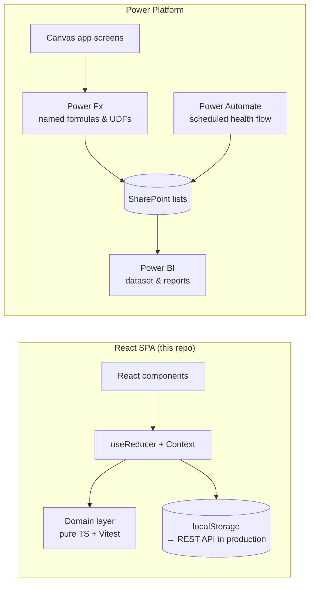

# Architecture: React SPA vs. Power Apps

The same domain — objectives → initiatives → indicators → measurements — can be
delivered as a coded single-page app (this repository) or as a low-code Power
Platform solution. Both are valid; the right choice depends on who maintains it,
where the data must live and how much UX control is needed.

## Side-by-side

| Concern                   | React SPA                                                        | Power Apps (canvas) + SharePoint                                                                 |
| ------------------------- | ---------------------------------------------------------------- | ------------------------------------------------------------------------------------------------ |
| **Where rules live**      | `src/domain/*.ts` — pure functions, one source of truth          | Power Fx UDFs (`fnHealth`, `fnAchievement`), list validation, flows                              |
| **Testing**               | Vitest unit tests on every rule, CI on each PR                   | Test Studio / manual test scripts; rules duplicated in flows are hard to unit-test               |
| **Data store**            | Any API (here: `localStorage` demo)                              | SharePoint lists (or Dataverse for relational integrity & row-level security)                    |
| **Scale limits**          | Driven by the backend                                            | Delegation limits, 5 000-item view threshold, 2 000-row non-delegable cap                        |
| **UX control**            | Full: custom SVG charts, Gantt, responsive layout, accessibility | Good for forms/galleries; custom visuals need PCF components or Power BI embeds                  |
| **Auth & identity**       | Must be integrated (OIDC/MSAL)                                   | Built in (Microsoft 365 identity, `User()`)                                                      |
| **Offline / performance** | Fully client-side, instant filtering                             | Network-bound; caching in collections is essential                                               |
| **Delivery speed**        | Slower first version, faster to evolve with tests                | Very fast first version, especially for forms-over-data                                          |
| **Who maintains it**      | Developers (TypeScript, Git, CI/CD)                              | Makers / citizen developers with governance from IT                                              |
| **ALM**                   | Git, PR reviews, GitHub Actions, preview deploys                 | Solutions, environments (Dev/Test/Prod), pipelines, managed solutions                            |
| **Licensing**             | Hosting cost only                                                | Included with many M365 plans for SharePoint connectors; premium for Dataverse/custom connectors |
| **Analytics**             | Custom dashboards in-app                                         | Power BI on the same lists, row-level security in the dataset                                    |

## Mapping of building blocks

| React (this repo)                      | Power Platform equivalent                                            |
| -------------------------------------- | -------------------------------------------------------------------- |
| `domain/types.ts`                      | SharePoint list schema (`sharepoint-schema.md`)                      |
| `domain/validation.ts`                 | Power Fx validation before `Patch` + list/column validation formulas |
| `domain/logic.ts` → `assessInitiative` | `fnHealth` UDF + scheduled flow writing `HealthCached`               |
| `domain/logic.ts` → `rollUpProgress`   | `AddColumns(... Sum(...))` over cached collections                   |
| `state/reducer.ts` (cascade deletes)   | Lookup "restrict delete" + soft delete (`IsActive`)                  |
| `state/storage.ts`                     | Connector calls; collections as the client cache                     |
| `useSearchParams` filters              | Context variables / `Param()` deep links                             |
| React Router pages                     | Screens + `Navigate()`                                               |
| `Dashboard` SVG charts                 | Power BI tiles embedded, or built-in charts                          |
| `Timeline` Gantt                       | PCF Gantt component, or Power BI Gantt visual                        |

## When to choose which

**Choose Power Apps when** the audience already lives in Microsoft 365, the
data must stay in the tenant, the team maintaining it is not a dev team, and the
first version is needed in days. Keep lists under the delegation limits (or use
Dataverse), centralize rules in named formulas/UDFs, and pre-compute derived
fields with flows so Power BI can reuse them.

**Choose a coded SPA when** the UX is a differentiator (custom visuals,
public-facing, mobile-first), the rules are complex enough to deserve unit
tests, the data comes from several systems/APIs, or licensing per user is a
concern.

**Hybrid** is common: Power Apps for data entry by owners, SharePoint/Dataverse
as the system of record, Power BI for executive reporting, and a small coded app
or PCF component where the low-code UX runs out (e.g. an interactive Gantt).

## Keeping both builds consistent

1. The thresholds (`RULES` in `logic.ts`) are mirrored as named formulas
   (`nfScheduleTolerance`, `nfBurnTolerance`).
2. Every rule has a unit test in TypeScript; the same test cases are used as the
   manual test script for the Power Fx UDFs.
3. Derived values used by reporting (`HealthCached`, `LatestValue`) are written
   by a single flow, so the app, views and Power BI never disagree.
